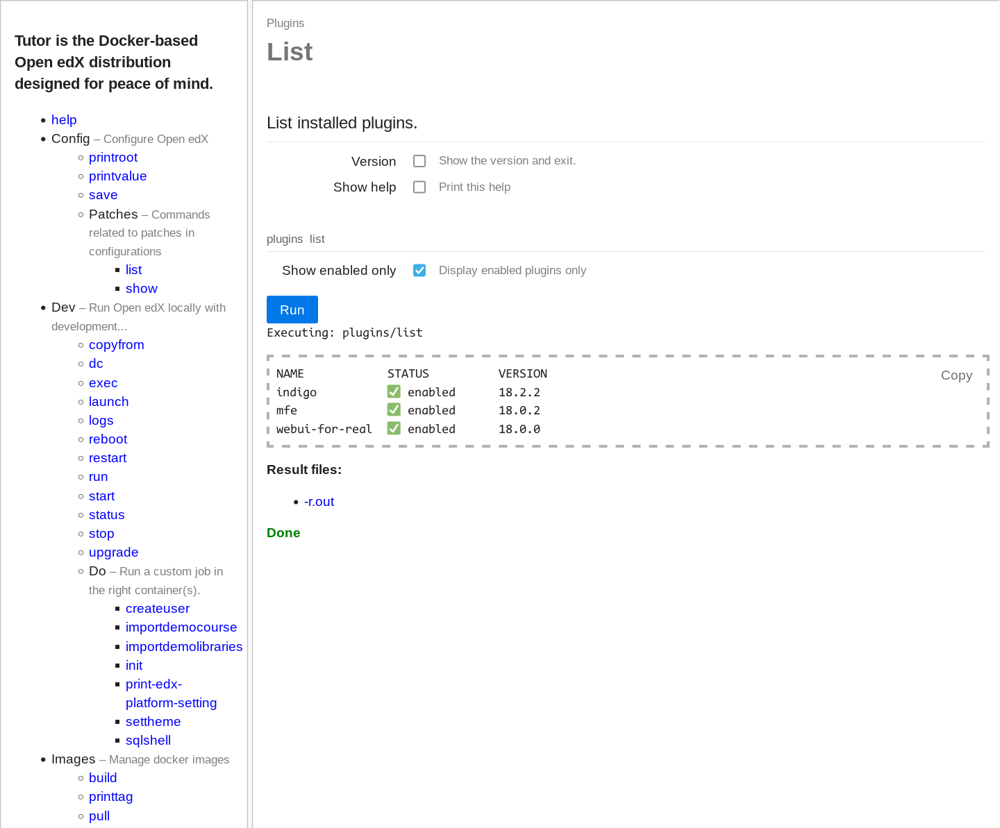

# webui-for-real plugin for [Tutor](https://docs.tutor.edly.io)

An actual web UI for Tutor.




## Installation

```sh
pip install git+https://github.com/tecoholic/tutor-contrib-webui-for-real.git
```

## Usage

```sh
tutor plugins enable webui-for-real
tutor webui-for-real start
```

The webui should be accessible from http://localhost:5000.

> [!WARNING]
> This uses the [click-web](https://github.com/fredrik-corneliusson/click-web) under the hood and is useful for quickly running non-interactive Tutor commands.
> *DO NOT* use this to run interactive commands like launching a shell.

## License

This software is licensed under the terms of the AGPLv3.
